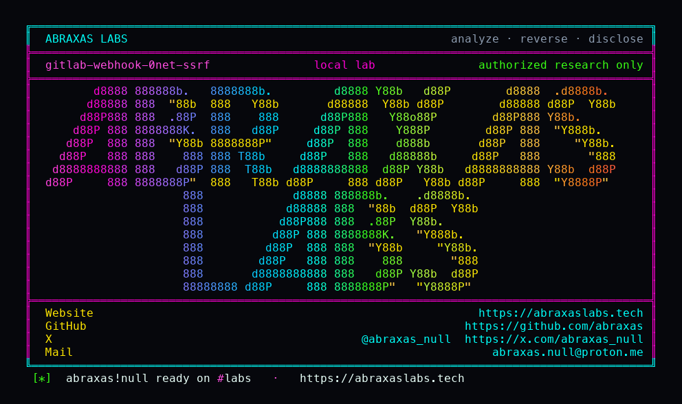

<p align="center">
  
</p>

<p align="center">
  <a href="https://abraxaslabs.tech"><strong>abraxaslabs.tech</strong></a>
  &nbsp;·&nbsp;
  <a href="https://github.com/abraxas">github.com/abraxas</a>
  &nbsp;·&nbsp;
  <a href="https://x.com/abraxas_null">@abraxas_null</a>
  &nbsp;·&nbsp;
  <a href="mailto:abraxas.null@proton.me">abraxas.null@proton.me</a>
  &nbsp;·&nbsp;
  <a href="https://github.com/abraxas/gitlab-webhook-0net-ssrf">gitlab-webhook-0net-ssrf</a>
</p>

# gitlab-webhook-0net-ssrf

**GitLab** CE `19.4.1` - GitLab Inc.

`Gitlab::HTTP_V2::UrlBlocker` blocks exact `0.0.0.0`, `::`, and `127.0.0.0/8`. It does not block the rest of `0.0.0.0/8`. Linux treats that range as "this network" and will deliver `0.0.0.1` to the local stack. A project Maintainer can create a webhook at `http://0.0.0.1:<port>/` while `allow_local_requests_from_web_hooks_and_services` is off. GitLab stores 8 KB of the response in hook logs.

**A Maintainer of their own project can make GitLab POST to loopback via `0.0.0.1` and read the body back out of the hook log.**

| | |
|---|---|
| ID | no CVE yet |
| CWE | [CWE-918](https://cwe.mitre.org/data/definitions/918.html) |
| CVSS | **High: 8.5** `CVSS:3.1/AV:N/AC:L/PR:L/UI:N/S:C/C:H/I:L/A:N` |
| Product | [GitLab CE](https://gitlab.com/gitlab-org/gitlab) |
| Affected | **19.4.1-ce.0** (`26212baacadb` on the v19.4.1-ee tree) |
| Auth | authenticated Maintainer (`admin_web_hook`) |
| License | [GNU Affero GPL v3.0](LICENSE) |
| Lab | `127.0.0.1` only |

## What an attacker can do

`POST /api/v4/projects/:id/hooks` with `url=http://0.0.0.1:<port>/`. Trigger or test. Read `response_body` from the hook events API. On all-in-one omnibus, Sidekiq shares the container netns with Puma, Workhorse, and exporters. Maintainer of **their** project should not read those.

`http://127.0.0.1/` and `http://169.254.169.254/` stay blocked. This is not IMDS via link-local. It is the this-network hole.

Same product, sibling leftovers: [Gitea HTTPS import pin drop](https://github.com/abraxas/gitlab-gitea-import-ssrf), [Gitaly fetch omits resolved_address](https://github.com/abraxas/gitlab-gitaly-fetch-ssrf).

## How I found it

I read `url_blocker.rb` after the 19.4.1 SSRF fixes. `validate_localhost` is exact `"::"` and `"0.0.0.0"` plus `Socket.ip_address_list`. `validate_loopback` is `ipv4_loopback?` (`127.0.0.0/8`) and ipv6 loopback. Specs cover octal/hex aliases of `127.0.0.1`. They never mention `0.0.0.1`.

Webhook is the body sink: [`WebHookService`](https://gitlab.com/gitlab-org/gitlab/-/blob/v19.4.1-ee/app/services/web_hook_service.rb) POSTs and stores 8 KB. Maintainer has `admin_web_hook`.

I stood up stock [`gitlab/gitlab-ce:19.4.1-ce.0`](https://hub.docker.com/r/gitlab/gitlab-ce). Local-requests off. Catcher inside the GitLab netns on `0.0.0.1:18080`. Hook create `http://127.0.0.1:18080/` and `http://169.254.169.254/` : 422 `Invalid url given`. Hook create `http://0.0.0.1:18080/` : 201. Test push events : 201. Hook events `response_body` contains `GITLAB-WEBHOOK-0NET-SSRF-WITNESS`.

Wrong turns already recorded: `/users/sign_in` with `Accept: application/json` is 404; seed password containing `root` is WeakPasswords; adding `0.0.0.1` to `lo` puts it on `Socket.ip_address_list` so `validate_localhost` 422s the "positive"; `IP_FREEBIND` plus `ip route add local 0.0.0.1/32 dev lo` binds without joining the address list; compose `$` in the password needs `$$`. A reverse shell. Theatre. The oracle is 201 on `0.0.0.1`, 422 on `127.0.0.1`, witness in the log.

## Lab

```bash
cd lab
./run.sh
```

Target **only** `http://127.0.0.1:18420`. GitLab CE wants several GB RAM. Authorized lab only.

```text
negative-a 127.0.0.1 blocked
negative-b link-local blocked
positive-hook id=1
SUCCESS GITLAB-WEBHOOK-0NET-SSRF webhook response_body from 0.0.0.1:18080 hook_id=1 GITLAB-WEBHOOK-0NET-SSRF-WITNESS
```

## The leftover

```ruby
def validate_localhost(addrs_info)
  local_ips = ["::", "0.0.0.0"]
  local_ips.concat(Socket.ip_address_list.map(&:ip_address))
  return if (local_ips & addrs_info.map(&:ip_address)).empty?
  raise BlockedUrlError, "Requests to localhost are not allowed"
end

def validate_loopback(addrs_info)
  return unless addrs_info.any? { |addr| addr.ipv4_loopback? || addr.ipv6_loopback? }
  raise BlockedUrlError, "Requests to loopback addresses are not allowed"
end
```

Deny `0.0.0.0/8` (and `::ffff:0.0.0.0/104`) the same way `127.0.0.0/8` is denied.

## References

- [gitlab.com/gitlab-org/gitlab](https://gitlab.com/gitlab-org/gitlab) tag [v19.4.1-ee](https://gitlab.com/gitlab-org/gitlab/-/tree/v19.4.1-ee)
- [`url_blocker.rb`](https://gitlab.com/gitlab-org/gitlab/-/blob/v19.4.1-ee/gems/gitlab-http/lib/gitlab/http_v2/url_blocker.rb) · [`web_hook_service.rb`](https://gitlab.com/gitlab-org/gitlab/-/blob/v19.4.1-ee/app/services/web_hook_service.rb) · [`project_hooks.rb`](https://gitlab.com/gitlab-org/gitlab/-/blob/v19.4.1-ee/lib/api/project_hooks.rb)
- Same product: [gitlab-gitea-import-ssrf](https://github.com/abraxas/gitlab-gitea-import-ssrf) · [gitlab-gitaly-fetch-ssrf](https://github.com/abraxas/gitlab-gitaly-fetch-ssrf)
- [CWE-918](https://cwe.mitre.org/data/definitions/918.html)

## License

GNU Affero GPL v3.0. See [LICENSE](LICENSE). Loopback lab only. No warranty.
